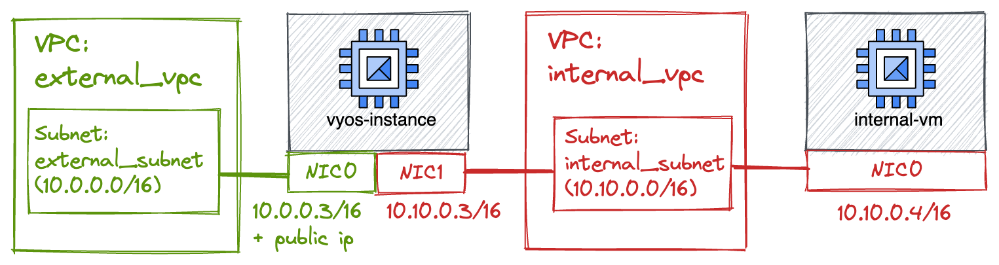

# VyOS as internet web-proxy
This example shows how to use this module to instantiate a VyOS instance that acts as web-proxy for virtual machines hosted on a RFC1918 private network.

The following diagram explains the target result of this terraform project.

In this example we create a single VyOS instance, with two network interfaces, attached to distinct networks: one for external traffic (external_vpc) and one for internal traffic (internal_vpc).

On the internal network, we spawn another VM, which has a single network interface with a private IP. This VM is not able to reach the internet directly, since it has no public IP nor there's any cloud NAT appliance attached to the internal network.

On the internal VM we configure a system-wide web-proxy, poiting to the VyOS instance.

