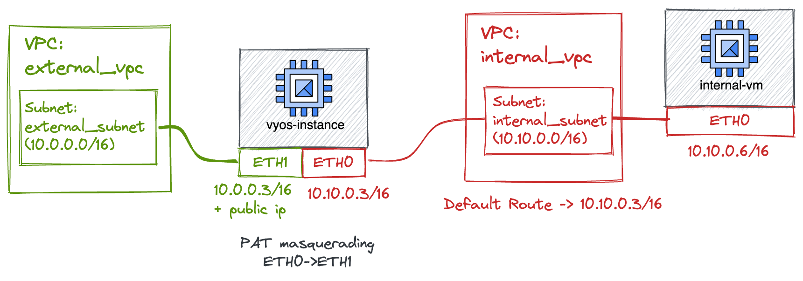

# VyOS as RFC1918 NAT
This example shows how to use this module to instantiate a VyOS instance that acts as an NAT appliance working in a RFC1918 address space.
In fact, at the time of writing, there is no managed GA solution to implement NAT/PAT on GCP: that requires an appliance to be configured. 

This specific example implements a simple NAT instance routing traffic from internal VPC to another internal VPC.
Specifically, the idea is to enable corporate to workaround their overlapping IP address space problems (on on-premise) with a cloud NAT instance.

The following diagram explains the target result of this terraform project.

A custom static route redirects all the traffic from the internal vpc network towards the VyOS instance, configured as next-hop.
The VyOS instance is configured to apply PAT to TCP and UDP packets coming from 10.10.0.0/16 (address space of internal_subnet)
and to masquerade it via ETH1 address (10.0.0.3/16). This configuration handles the traffic against RFC1918 targets belonging
to the external VPC, but also performs NATTING against public endpoints, using the VyOS ETH1 public address. 

In case you need to only apply transparent nat/pat to traffic coming from specific instances within the internal_vpc, you 
could simply change the default route to apply only to instances with a specific tag, making sure to assign such a tag to the
VMs to NAT.