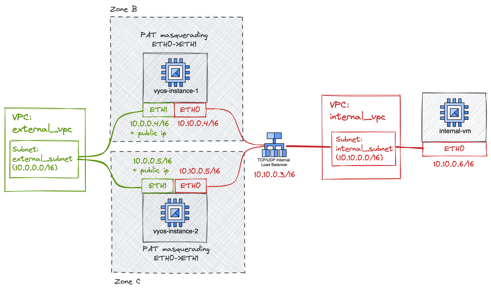

# VyOS as RFC1918 High Available NAT
This module is an evolution of the NAT example. Instead of using a single VyOS instance, it relies on
two active/active instances, each one running on a distinct zone. 
An internal load balancer takes care of dispatching the connections among the two instances.

A custom static route redirects all the traffic from the internal vpc network towards internal load balancer on top of the two VyOS instances.
Both the VyOS instances are configured to apply PAT to all IP traffic (including ICMP, TCP, UDP, etc) coming from 10.10.0.0/16 (address space of internal_subnet),
masquerading it via ETH1 address (10.0.0.3/16). This configuration handles the traffic against RFC1918 targets belonging
to the external VPC, but also performs NATTING against public endpoints, using the VyOS ETH1 public address. 

In case you need to only apply transparent nat/pat to traffic coming from specific instances within the internal_vpc, you 
could simply change the default route to apply only to instances with a specific tag, making sure to assign such a tag to the
VMs to NAT.

## Limitation
We use two ILBs for TCP and UDP traffic translation. The usage of a single ILB with shared IP is not supported on GCP when using custom routes
with an ILB as next hop: [Forwarding rules that use a common internal IP address (--purpose=SHARED_LOADBALANCER_VIP) are not supported.](https://cloud.google.com/load-balancing/docs/internal/ilb-next-hop-overview#additional_considerations).

The usage of two VyOS instances as NAT devices in an ACTIVE/ACTIVE configuration without any client stickiness logic might be an issues in special cases. For instance, consider the FTP protocol case. 
A classic FTP session usually establishes two or more TCP connections: one for the control channel 
(to issue FTP commands), and one or more for the data transfers. The problem in this situation is that there is asolutely no warranty that all the TCP connections go through the very same VyOS instance. 
If that happens, most FTP servers will refuse the connection of all the data-transfer channels that
are NATTED via the other VyOS instance, as they are masquerated via an IP address that differs from the
one used by the control channel.

To solve this issue you might:
- change the ILB logic, so that all the traffic coming from a client IP is routed consistently using the same VyOS instance.
- rely on example 5, which applies masquerading using an IP address of another ILB.

## Special notes
Please be aware that the usage of a custom route targeting a forwarding rule (TCP/UDP load balancing) is required to handle the all TCP, UDP and lower-level IP traffic.
This "route-all" feature is an exception which bypasses the backend-service and forwarding rule limitations, as [explained here](https://cloud.google.com/load-balancing/docs/internal/ilb-next-hop-overview).
