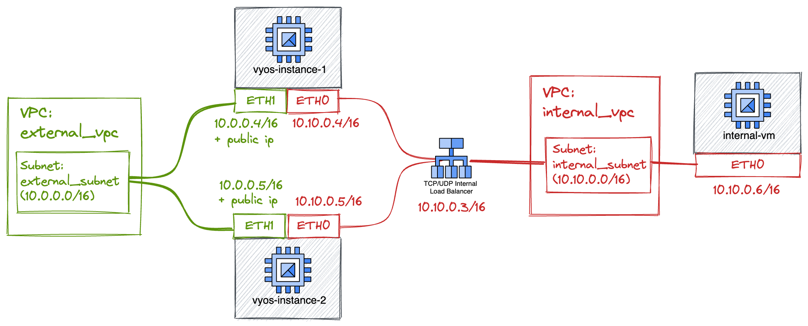

# VyOS as internet web-proxy
This example shows how to use this module to instantiate a VyOS instance that acts as an HA web-proxy for virtual machines hosted on a RFC1918 private network.

The following diagram explains the target result of this terraform project.

In this example we create two VyOS instances, load balanced via a TCP/UDP internal load-balancer. Each VyOS instance has two network interfaces, attached to distinct networks: one for external traffic (external_vpc) and one for internal traffic (internal_vpc).

On the internal network, we spawn another VM, which has a single network interface with a private IP. This VM is not able to reach the internet directly, since it has no public IP nor there's any cloud NAT appliance attached to the internal network.

On the internal VM we configure a system-wide web-proxy, poiting to the internal load balnacer.

## Limitations and heads-up
### Session affinity
This example does not use any session affinity mechanism: each request from the internal VM might be proxied by vyos-instance-1 or vyos-instance-2. 
The target system will therefore see requests coming from two different IP addresses. This configuration might not be ideal for specific
protocols as FTP (where the data channel and the command channel are expected to use the same source ip). In those cases, you might
want to use cloud-nat instead of assigning public IP addresses to the VyOS instances, or apply masquerade natting via VyOS.

### Duplicated configuration buckets
This example uses two different buckets with two distinct configuration files, but driven with the same terraform template. 
This is not optimal, as one might use the same configuration object and two pubsub subscription instead of having dubplicated bucket/subscriptions.

### WebProxy listen address
This examples configures the VyOS instance behind a TCP/UDP internal load balancer for the 3128 TCP port, which is based on Andromeda network stack. 
With this configuration, the IP packets that target the ILB, are delivered to the VMs with the original target IP, which belongs to the Internal Load Balancer.
This means that the listen address of the web-proxy service must bind that IP address (10.10.0.3/16) rather than the specific VMs addresses (10.10.0.4/16 and 10.10.0.5/16).
